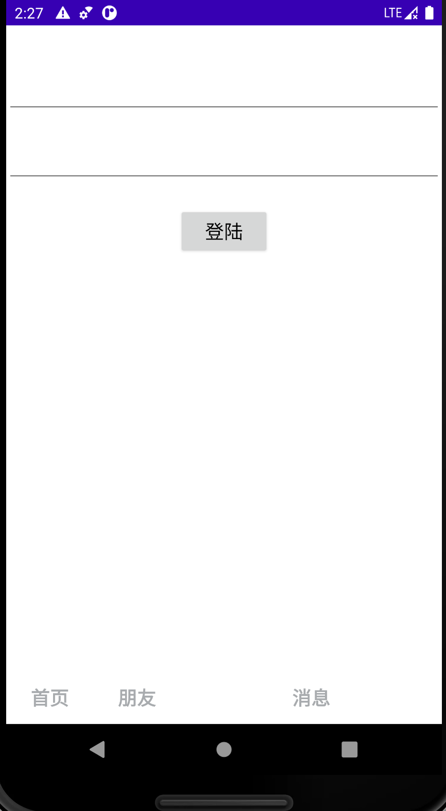

## Bytedance-SJTU-Homework

### 基本功能：

#### 首页

1. 封面展示，基于handler延时3s发送message进入主页

#### 主页

1. 基于fake data的音乐title跑马灯，用户名，内容显示
2. 音乐播放器lottie动画（TODO：音乐Service）
3. 点赞，查看评论，分享功能
4. 分页（首页，个人页等）切换
5. seekbar实时更新与拖拽

#### 个人页

1. 登陆功能
2. 个人信息页展示，网格布局单击进入视频

#### 视频拍摄页

1. 照片拍摄保存本地
2. 视频拍摄保存本地
3. 支持选取本地文件上传至服务器

### 亮点：

1. 视频单击暂停，双击点赞动画
2. 基于RecyclerView和PagerSnapHelper实现单页滑动
3. 基于BottomSheetDialogFragment的弹出式评论与分享功能
4. 基于binder通信的后台service实现下载
5. 视频拉取时加载动画
6. receiver监听网络状况（TODO: onReceive()中功能完善，目前仅是Toast提示）
7. 分享栏目自定义View中的自定义属性，以指定对应icon集合

### 难点：

1. 复用：自定义view复用（icon和文字，横向recyclerVIew）/代码复用/工具类编写
2. 组件与fragment之间通信
3. 接口回调

